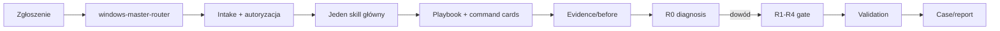

# Architektura

Repo ma trzy warstwy: `.agents/skills` odpowiada za routing i workflow, `knowledge-base` jest
źródłem danych wspólnym dla człowieka i agenta, a `scripts` zapewnia deterministyczne collectory,
parsery, raporty i kontrolowane wrappers. Skills stosują progressive disclosure: description →
SKILL.md → jedna wskazana referencja. `_shared` nie jest skillem.

Machine-readable YAML files are emitted as JSON, which is valid YAML 1.2 and permits dependency-free
validation. IDs are stable: `<skill>-pb-NN`, `<skill>-cmd-NN`, source/tool IDs in kebab-case.
Packager copies `_shared` into each `dist/skills/<skill>/references/_shared`, so installed skills
do not depend on repository-relative resources.

Model danych: playbook schema, source schema, tool catalog schema, eval schema i case schema są w
`.agents/skills/_shared/schemas`. `coverage-matrix.yaml` links a symptom class to a concrete
playbook file. Versioned facts live in release/source registers, not repeated prose.
